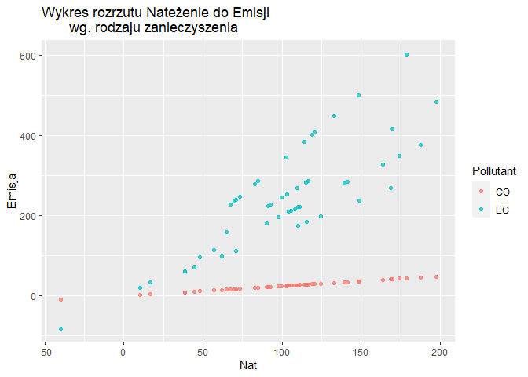

# Cos na poczatek o boroscript

Pakiet został stworzonyw ramach z przedmiotu “Metody Inwentaryzacji i
Szacowania Emisji”. Kod źródłowy został stworzony w języku R. Pakiet
służy do obliczania emisji zanieczyszczeń wytwarzanych przez pojazdy z
silnikami spalinowymi oraz do prezentacji wykonanych obliczen za pomoca
wykresu rozrzutu natężenia do emisji wg.rodzaju zanieczyszczenia.

## Instalacja

``` r
# w razie potrzeby należy zainstalować pakiet devtools
if (!require(devtools)) {install.packages("devtools"); require(devtools)}
# instalacja z GitHub
install_github("BORO1999/boroscript", force = T, build_vignettes = T)
library(boroscript)
```

## Przyklad

Podstawowy przyklad zastosowania funkcji:

``` r
wynik<-fun_pack()
```

Pakiet pozwala na obliczenie i rysowanie wykresu:

``` r
boro_plot(wynik)
```



Podaje prosty i szybki dostep do winiety z informacjami na temat
pakietu:

``` r
browseVignettes("boroscript")
vignette("my-vignette")
```
